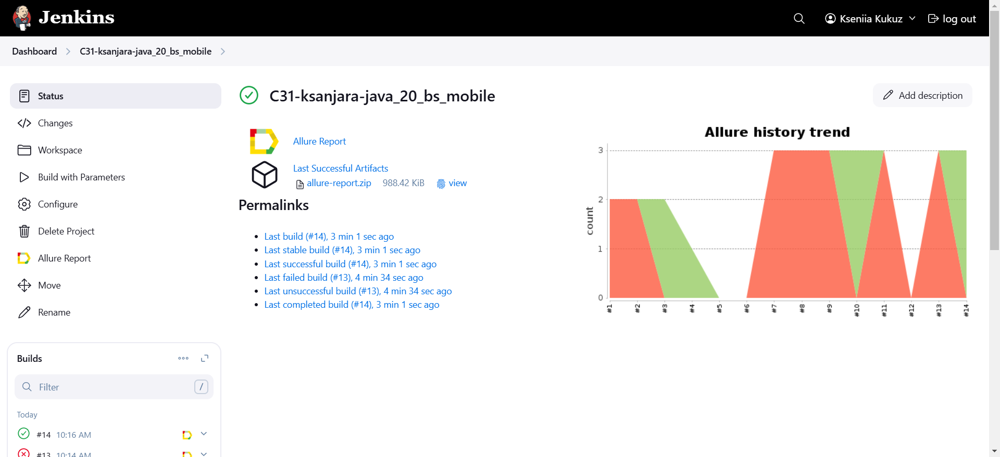
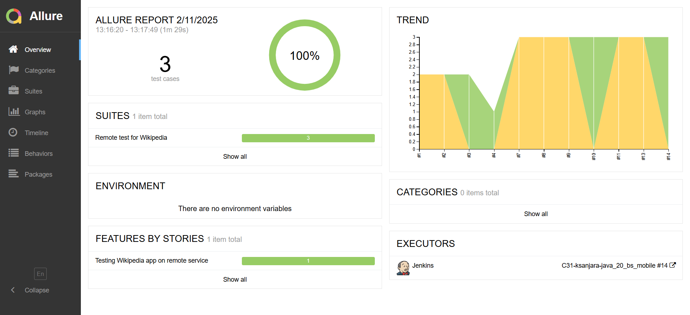
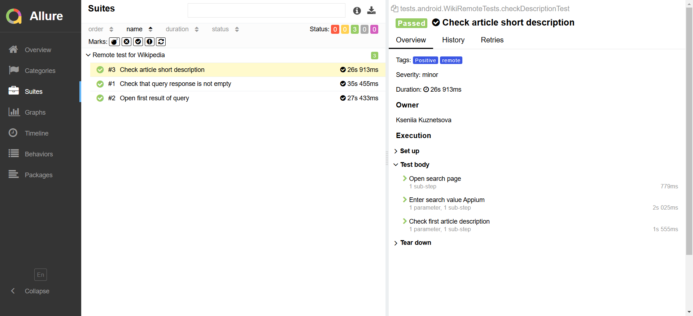
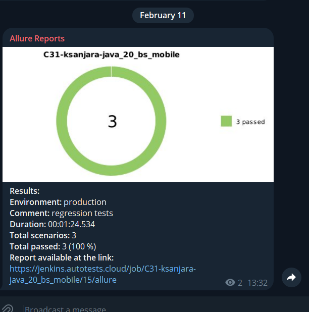
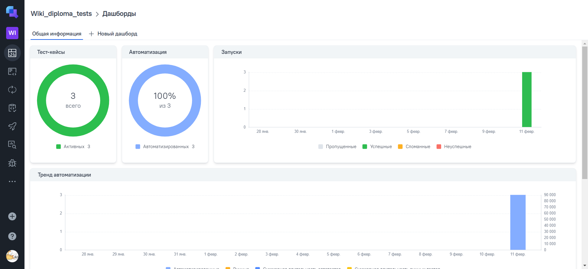
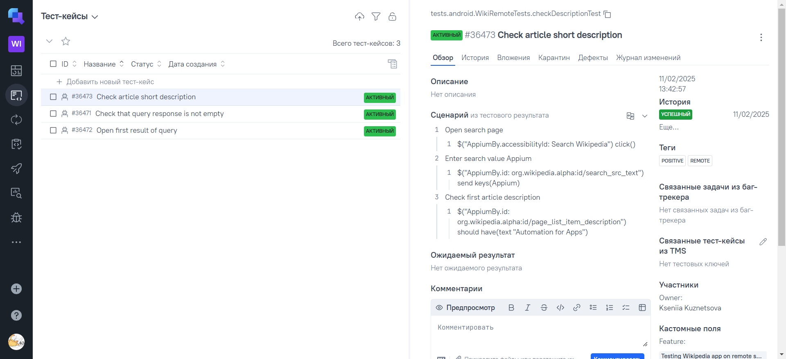
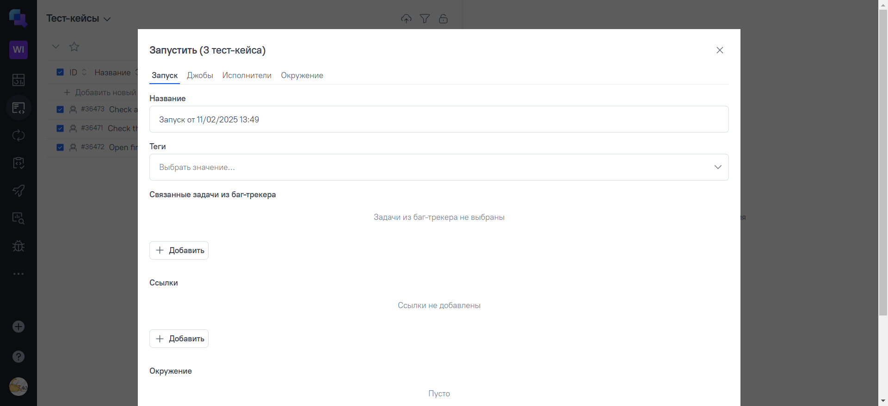
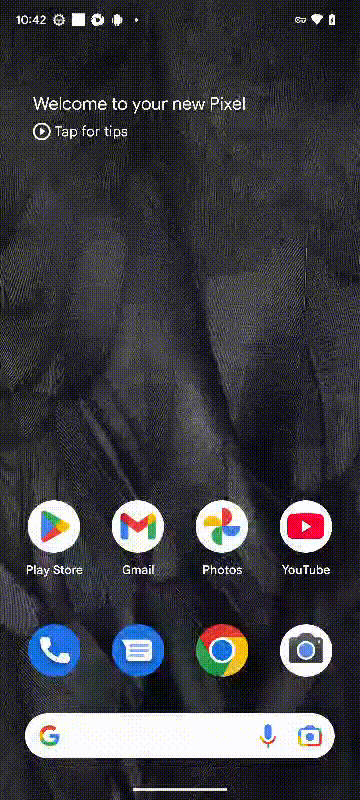

# Automated mobile tests for [Wikipedia](https://www.wikipedia.org/) mobile app

## :page_with_curl: Content:

- <a href="#tools"> Instruments used</a>
- <a href="#checking"> Test cases</a>
- <a href="#console"> How to run tests using command line</a>
- <a href="#jenkins"> Jenkins build</a>
- <a href="#report"> Allure report</a>
- <a href="#testops"> Integration with AllureTestOps</a>
- <a href="#tg"> Telegram notifications using chat bot</a>
- <a href="#browserstack"> Test run video</a>
---

## 🔨 Instruments used:

| Java                                                                                                    | IntelliJ     Idea                                                                                                      | GitHub                                                                                                     | JUnit 5                                                                                                          | Gradle                                                                                                    | Allure   Report                                                                                                                | Appium                                                                                                   | Browserstack                                                                                                                                       | Jenkins                                                                                                         | Telegram                                                                                                         |                                                                                               Allure   TestOps |
|:--------------------------------------------------------------------------------------------------------|---------------------------------------------------------------------------------------------------------------------------|------------------------------------------------------------------------------------------------------------|------------------------------------------------------------------------------------------------------------------|----------------------------------------------------------------------------------------------------------------------------------------------------------------------------------------------------------------------------|-----------------------------------------------------------------------------------------------------------------------------------|----------------------------------------------------------------------------------------------------------|----------------------------------------------------------------------------------------------------------------------------------------------------|---------------------------------------------------------------------------------------------------------------------------------------|------------------------------------------------------------------------------------------------------------------|------------------------------------------------------------------------------------------------------------------:|
|  |  |  |  |   |   |  | <a href="https://www.browserstack.com/"> 
 </a> 
 |  |  |  |

Autotests are created using `Java` programming language with plugins: `JUnit 5`, `Selenide`, `Appium`. Project builder - `Gradle`. For remote build job in `Jenkins` created with creating `Allure Report` at the end of the testing run.
After all tests when Allure Report is ready there are `Telegram notifications` using chat bot realized.
Autotests may be launched locally using `Android Studio` or remotely using `Browserstack` service.

---

## :male_detective:: Test Cases

**Local test cases**:
- ✓ Check Onboarding screens
- ✓ Save article
- ✓ Testing of search

**Remote test cases**:
- ✓ Check that query response is not empty
- ✓ Open first result of query
- ✓ Check article short description

### :compass: How to run tests using command line
**Local launch:**

`gradle clean local_test`

**Remote launch:**

`gradle clean remote_test -DdeviceHost=browserstack
-Dlogin=${BROWSERSTACK_LOGIN}
-Dpassword=${BROWSERSTACK_KEY}`

Where:
- ${BROWSERSTACK_LOGIN} - browserstack username
- ${BROWSERSTACK_KEY} - browserstack integration key

Not required parameters:
- `-DdeviceModel=${DEVICE}` - model of emulated device (default value is "Google Pixel 7")
- `-DosVersion=${OS_VERSION}` - os version of device (default value is "13.0")

---

## </a> <a target="_blank" href="https://jenkins.autotests.cloud/job/C31-ksanjara-java_20_bs_mobile/"> Jenkins</a> build
To run this test through Jenkins, please use this [job](https://jenkins.autotests.cloud/job/C31-ksanjara-java_20_bs_mobile/), specially created for this project.
To run it please use `Build with Parameters` button, default credentials are set.
You can see the results via Allure Reports by clicking on Allure icon near build.

---

##  [Allure](https://jenkins.autotests.cloud/job/C31-ksanjara-java_23_diploma-api-tests/) Report

### 🖨️ Report main page

### 📄 Test cases page

---

##  Telegram notifications

### Notification example in telegram channel

#### Telegram notification contains:

- :heavy_check_mark: Environment
- :heavy_check_mark: Comment
- :heavy_check_mark: Duration
- :heavy_check_mark: Total scenarios
- :heavy_check_mark: Total passed tests
- :heavy_check_mark: Total failed tests
- :heavy_check_mark: Total broken tests
- :heavy_check_mark: Allure Report link

---

##  [Allure TestOps](https://allure.autotests.cloud/project/4624/test-cases/36473?treeId=0) integration

### Dashboard

### Test cases

### Create automated run from Allure TestOps

## </a> Video example from Browserstack

For every test in Allure Report video is attached.

  

